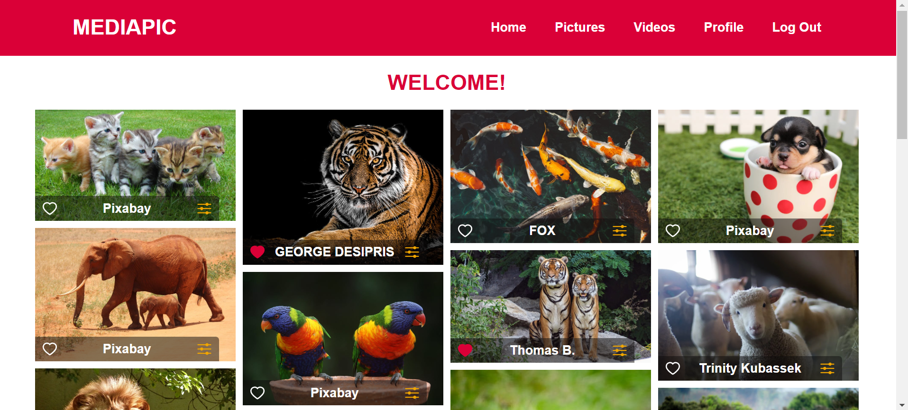
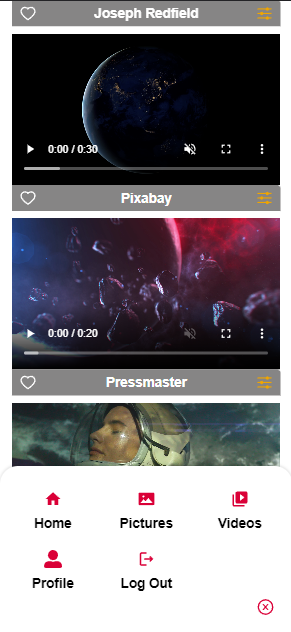

# MEDIAPIC App

Pictures and videos gallery with PEXELS API.

Includes:

1.  Log In page with (google account allowed).
2.  Main page with phots gallery.
3.  View with photos searcher.
4.  View with videos searcher.
5.  View with favorites and profile info.

# Deployment

VERCEL:

[LINK](https://mediapic-app.vercel.app/login)

## Screenshots

Desktop version:

Mobile version:

## Libraries and tools

1.  [REACT](https://en.reactjs.org/)
2.  [REACT ROUTER](https://reactrouter.com/)
3.  [REACT ICONS](https://react-icons.github.io/react-icons/)
4.  [REDUX](https://redux.js.org/)
5.  [REDUX THUNK](https://redux.js.org/usage/writing-logic-thunks)
6.  [TAILWIND CSS](https://tailwindcss.com/docs/guides/create-react-app)
7.  [FIREBASE](https://firebase.google.com/)

## Install and run project

1. Clone repo.
2. Install modules `npm install`.
3. Make an account and get an api key in [Pexels api](https://www.pexels.com/).
4. Make an account and a database to get keys in [Firebase](https://firebase.google.com/).
5. Check .env.example file and create a `.env` file.
6. Setting up Tailwind CSS check [documentation link](https://tailwindcss.com/docs/guides/create-react-app).
7. Run project `npm start`.
